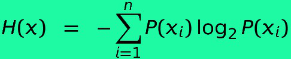

# Shannon, Entropy and Elegant Code

So I needed to compute the compute the entropy measure of some discrete data to identify if it was worthwhile to use in a model.



See [Wiki](https://en.wikipedia.org/wiki/Entropy_(information_theory)) for an explanation.


It was very pleasing and easy to do in Scala as:
```scala
import scala.math.log

object EntropyMeasure {
  private val log_2 = log(2.0)

  def log2(x : Double) = log(x) / log_2
  def entropy(p : Seq[Double]) : Double = -(p.map(p => p * log2(p)).sum)
}
```

And testing was also fun
```scala
import org.scalatest.FlatSpec
import com.hpe.orderbook.nn.EntropyMeasure.entropy
import scala.math.abs

class EntropyMeasureTest extends FlatSpec {
  val verySmall = 1e-3
    "entropy of single value" should "be zero" in {
      val ent = entropy(Seq(1.0))
      assert(abs(ent) < verySmall)
    }

   "entropy of fair coin" should "be unity" in {
     val ent = entropy(Seq(0.5,0.5))
     assert(abs(ent - 1.0) < verySmall)
   }

  "entropy of a fair die" should "be close to 2.5849" in {
    val expected = 2.5849
    val oneOverSix = 1.0 / 6.0
    val ent = entropy((1 to 6).map(_ => oneOverSix))
    assert(abs(ent-expected) < verySmall)
  }
}
```

Not overly complicated. Not earth-shattering. But very (for me at least) pleasing and satisfying.

[Home](../../README.md)
